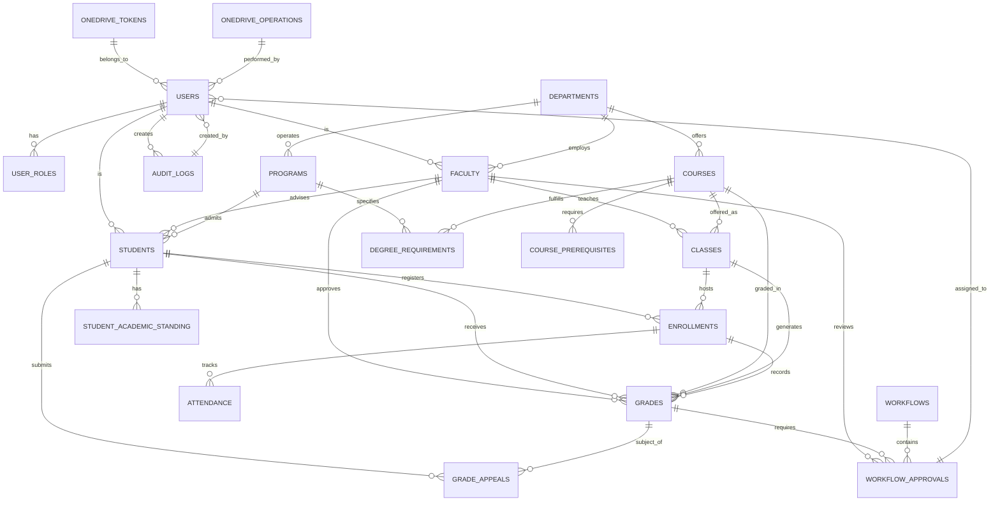

# Entity-Relationship Diagram - Academic Department360 Dashboard

## 1. Simplified ER Diagram (Mermaid)



---

## 2. Core Entity Relationships

### 2.1 User Management

```
┌─────────────────────────────────────────┐
│              USERS (Core)                │
├─────────────────────────────────────────┤
│ id (PK) UUID                            │
│ email VARCHAR UNIQUE                    │
│ password_hash VARCHAR                   │
│ first_name VARCHAR                      │
│ last_name VARCHAR                       │
│ status ENUM                             │
│ created_at TIMESTAMP                    │
└─────────────────────────────────────────┘
         │
    ┌────┴────────┬──────────────┐
    │             │              │
    ↓             ↓              ↓
┌────────┐   ┌────────┐   ┌──────────┐
│FACULTY │   │STUDENTS│   │ADMIN_OPS │
└────────┘   └────────┘   └──────────┘
```

**Relationships**:
- `Users` → `Faculty` (1:0..1) - Optional, not all users are faculty
- `Users` → `Students` (1:0..1) - Optional, not all users are students
- `Users` → `User_Roles` (1:many) - User can have multiple roles

---

### 2.2 Academic Structure

```
┌──────────────┐          ┌────────────┐
│  DEPARTMENTS │◄────────►│  PROGRAMS  │
└──────────────┘          └────────────┘
       │                        │
       │                        ├──────────────┐
       │                        │              │
       ↓                        ↓              ↓
   ┌────────┐        ┌──────────────────────────────┐
   │COURSES │        │DEGREE_REQUIREMENTS           │
   └────────┘        ├──────────────────────────────┤
       │             │ program_id (FK) → PROGRAMS   │
       │             │ course_id (FK) → COURSES     │
       ↓             │ required_credits INT         │
   ┌────────┐        │ prerequisites TEXT           │
   │CLASSES │        └──────────────────────────────┘
   └────────┘
       │
       └──► CLASSES (Specific course offering in semester)
            - course_id (FK)
            - semester_id (FK)
            - instructor_id (FK → FACULTY)
            - section_number
            - time/location
```

**Key Relationships**:
- Departments offer Courses
- Courses have multiple Class instances (per semester)
- Programs specify Degree Requirements
- Requirements link Programs ←→ Courses

---

### 2.3 Enrollment & Grading Flow

```
┌──────────────────────────────────────────┐
│          ENROLLMENT PROCESS               │
└──────────────────────────────────────────┘

STUDENTS (1)
    │
    └──► ENROLLMENTS (many)
         │
         ├─ student_id (FK → STUDENTS)
         ├─ class_id (FK → CLASSES)
         ├─ semester_id (FK → SEMESTERS)
         ├─ enrollment_status
         └─ enrollment_date
              │
              ↓
         GRADES (1..1)
         │
         ├─ enrollment_id (FK → ENROLLMENTS)
         ├─ grade_numeric
         ├─ grade_letter
         ├─ grade_points
         ├─ is_draft (workflow state)
         ├─ is_approved (workflow state)
         ├─ submitted_by_id (FK → FACULTY)
         ├─ approved_by_id (FK → FACULTY)
         └─ submitted_at/approved_at (timestamps)
              │
         ┌────┴────────┬──────────┐
         │             │          │
         ↓             ↓          ↓
    WORKFLOW_APPROVALS (Approval chain)
         GRADE_APPEALS (If disputed)
         AUDIT_LOGS (All changes)
```

**Key States**:
- **Draft**: Faculty entering grades, can edit
- **Submitted**: Sent for approval, locked
- **Approved**: Department Head approved, final
- **Rejected**: Returned for revision

---

### 2.4 Workflow & Approval

```
┌──────────────────────────────────────────┐
│             WORKFLOWS                     │
├──────────────────────────────────────────┤
│ id (PK) UUID                             │
│ workflow_type ENUM                       │
│   - grade_submission                     │
│   - course_addition                      │
│   - grade_appeal                         │
│   - leave_request                        │
│   - curriculum_change                    │
│ status ENUM (draft, submitted, etc.)     │
│ initiated_by_id (FK → USERS)             │
│ completed_by_id (FK → USERS)             │
│ related_resource_type VARCHAR            │
│ related_resource_id UUID                 │
│ data JSONB (workflow-specific data)      │
└──────────────────────────────────────────┘
         │
         └──► WORKFLOW_APPROVALS (many)
              │
              ├─ workflow_id (FK → WORKFLOWS)
              ├─ approval_level INT (1, 2, 3...)
              ├─ assigned_to_id (FK → USERS)
              ├─ approval_status ENUM
              ├─ response_date
              ├─ escalation logic
              └─ reassignment support
```

**Workflow Levels**:
1. **Level 1**: Initial submission
2. **Level 2**: Department Head review
3. **Level 3**: Dean/Escalation
4. **Level 4**: Provost (if needed)

---

### 2.5 Security & Audit

```
┌────────────────────────────────────┐
│       AUDIT_LOGS                    │
├────────────────────────────────────┤
│ id (PK) UUID                       │
│ user_id (FK → USERS)               │
│ action VARCHAR                     │
│ resource_type VARCHAR              │
│ resource_id UUID                   │
│ old_values JSONB                   │
│ new_values JSONB                   │
│ ip_address INET                    │
│ ferpa_protected BOOLEAN            │
│ student_id (FK → STUDENTS) [FERPA]│
│ created_at TIMESTAMP               │
└────────────────────────────────────┘
     │
     └──► ONEDRIVE_OPERATIONS
          │
          ├─ user_id (FK → USERS)
          ├─ operation_type
          ├─ file_id
          ├─ file_path
          ├─ shared_with_email
          ├─ permission_type
          └─ created_at

USER_ROLES
├─ user_id (FK → USERS)
├─ role_id (FK → ROLES)
├─ department_id (FK → DEPARTMENTS)
├─ expires_at (optional for temp assignments)
└─ is_primary BOOLEAN
```

---

## 3. Cardinality Summary

| Relationship | Cardinality | Description |
|------------|-------------|-------------|
| User → Faculty | 0..1:1 | One user is optionally one faculty |
| User → Student | 0..1:1 | One user is optionally one student |
| User → User_Roles | 1:many | One user has many roles |
| Department → Faculty | 1:many | One dept employs many faculty |
| Department → Courses | 1:many | One dept offers many courses |
| Faculty → Classes | 1:many | One faculty teaches many classes |
| Course → Classes | 1:many | One course offered in many semesters |
| Class → Enrollments | 1:many | One class has many students |
| Student → Enrollments | 1:many | One student enrolls in many classes |
| Enrollment → Grades | 1:1 | One enrollment has one grade record |
| Grade → Workflow_Approvals | 1:many | One grade may have multiple approvals |
| Workflow → Workflow_Approvals | 1:many | One workflow has many approval steps |

---

## 4. Data Integrity Constraints

### Primary Keys
- All tables use UUID primary keys for distributed systems
- Auto-generated on creation
- Never reassigned

### Foreign Keys
```sql
-- Referential Integrity Examples

FACULTY.department_id → DEPARTMENTS.id
  ON DELETE: RESTRICT (cannot delete dept with faculty)
  ON UPDATE: CASCADE

ENROLLMENTS.student_id → STUDENTS.id
  ON DELETE: RESTRICT (soft delete student only)
  ON UPDATE: CASCADE

GRADES.enrollment_id → ENROLLMENTS.id
  ON DELETE: RESTRICT (cannot delete enrollment with grades)
  ON UPDATE: CASCADE

WORKFLOW_APPROVALS.workflow_id → WORKFLOWS.id
  ON DELETE: CASCADE (delete approvals if workflow deleted)
  ON UPDATE: CASCADE
```

### Unique Constraints
```sql
-- Email uniqueness per active user
UNIQUE (email) WHERE deleted_at IS NULL

-- Student ID unique per institution
UNIQUE (student_id)

-- Course code unique per department per semester
UNIQUE (course_id, semester_id, section_number)

-- Enrollment unique (no duplicate enrollments)
UNIQUE (student_id, class_id)
```

### Check Constraints
```sql
-- Grade numeric range
CHECK (grade_numeric >= 0 AND grade_numeric <= 100)

-- GPA range
CHECK (gpa >= 0 AND gpa <= 4.0)

-- Credit hours positive
CHECK (credit_hours > 0)

-- Enrollment capacity validation
CHECK (max_enrollment >= current_enrollment)

-- Date validations
CHECK (start_date < end_date)
```

---

## 5. Indexes for Performance

### Frequently Queried Paths

```
User Authentication:
├── users.email (indexed)
├── users.deleted_at (partial index)
└── users.created_at (indexed)

Student Lookup:
├── students.student_id (indexed, unique)
├── students.user_id (indexed, unique)
└── students.enrollment_status (indexed)

Course Search:
├── courses.department_id (indexed)
├── courses.is_active (indexed)
└── courses.course_code (indexed)

Enrollment Queries:
├── enrollments.student_id (indexed)
├── enrollments.class_id (indexed)
├── enrollments.semester_id (indexed)
└── (student_id, class_id, semester_id) composite index

Grade Lookup:
├── grades.enrollment_id (unique indexed)
├── grades.student_id (indexed)
├── grades.is_approved (indexed)
└── grades.submitted_at (indexed)

Workflow & Approval:
├── workflow_approvals.assigned_to_id (indexed)
├── workflow_approvals.approval_status (indexed)
├── workflow_approvals.due_date (indexed)
└── (workflow_id, approval_level) composite index

FERPA Audit:
├── audit_logs.ferpa_protected (indexed)
├── audit_logs.student_id (indexed)
├── audit_logs.created_at (indexed)
└── audit_logs.user_id (indexed)
```

---

## 6. Full-Text Search Indexes

```sql
-- Search courses by title and description
CREATE INDEX idx_courses_search 
  ON courses USING gin(
    to_tsvector('english', 
      title || ' ' || description
    )
  );

-- Search faculty by name and specialization
CREATE INDEX idx_faculty_search 
  ON faculty USING gin(
    to_tsvector('english', 
      name || ' ' || specialization
    )
  );
```

---

## 7. Partitioning Strategy (for large tables)

```
GRADES partitioned by semester:
├── grades_spring_2026
├── grades_fall_2026
└── grades_spring_2027

AUDIT_LOGS partitioned by year:
├── audit_logs_2025
├── audit_logs_2026
└── audit_logs_2027

Benefits:
- Faster queries on large datasets
- Easier archiving of old data
- Parallel query execution
- Smaller index sizes
```

---

## 8. Normalization Analysis

### Normal Forms Achieved

**1NF (Atomic Values)**:
- ✓ All fields contain atomic values
- ✓ No repeating groups

**2NF (No Partial Dependencies)**:
- ✓ All non-key attributes depend on entire primary key
- ✓ No composite keys with partial dependencies

**3NF (No Transitive Dependencies)**:
- ✓ No non-key attributes depend on other non-key attributes
- ✓ Example: Student.gpa depends only on enrollment data, not other student attributes

**BCNF (Boyce-Codd Normal Form)**:
- ✓ Every determinant is a candidate key
- ✓ No anomalies from functional dependencies

---

## 9. Denormalization Decisions

For performance optimization, some denormalization applied:

```
ENROLLMENTS table includes:
├── current_gpa (denormalized for faster dashboard)
│   └── Synchronized via trigger after grade approval
├── last_grade_date (denormalized for queries)
│   └── Updated via trigger
└── academic_standing (denormalized for performance)
    └── Recalculated nightly

Rationale:
- Dashboard queries need fast access to GPA
- Calculation would be expensive on millions of records
- Data consistency maintained via triggers
```

---

## 10. Data Growth Projections

```
Estimated table sizes (per 100 students):

USERS:              ~500 rows (students + faculty + staff)
STUDENTS:           100 rows
FACULTY:            20 rows
DEPARTMENTS:        5 rows
COURSES:            50 rows
CLASSES:            150 rows (per semester)
ENROLLMENTS:        1,500 rows (per semester)
GRADES:             1,500 rows (per semester)
AUDIT_LOGS:         50,000+ rows (per year)

Database Size:
- Small institution (1,000 students): 100-200MB
- Medium institution (10,000 students): 1-2GB
- Large institution (50,000 students): 5-10GB
```

---

## 11. Backup & Recovery Strategy

```
Daily Backups:
├── Full backup: Weekly (Sunday)
├── Incremental: Daily
└── Transaction logs: Hourly

Retention:
├── Daily backups: 30 days
├── Weekly backups: 90 days
├── Monthly backups: 1 year
└── Annual archives: 7 years (FERPA requirement)

Recovery Testing:
├── Monthly restore drills
├── Quarterly full recovery test
└── Annual disaster recovery simulation
```

